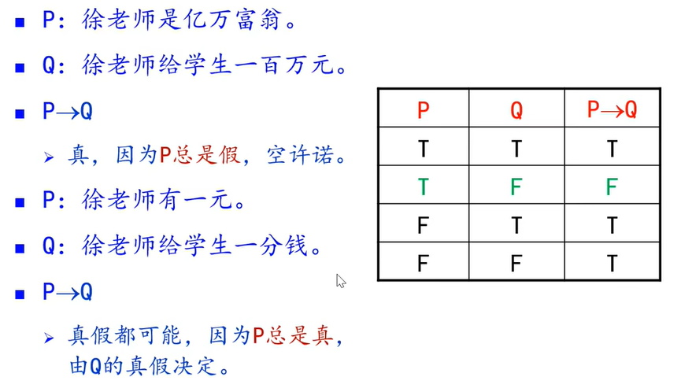
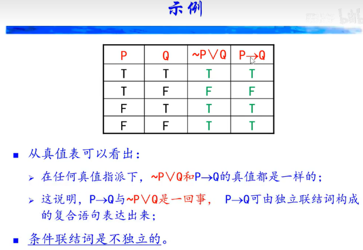

# 离散数学中南大学徐德智教授主讲笔记

*   西安电子科技大学出版社的《离散数学》第三版 方世昌著。
*   【离散数学 - 中南大学徐德智教授主讲（使用方世昌版教材）（全115集）】 https://www.bilibili.com/video/BV115411J7BZ/

# 第1章 数理逻辑

>   part1-命题概念至联结词
>
>   part2-等价问题至永真蕴含式
>
>   part3-代入规则-置换规则
>
>   part4-等值演算、对偶式
>
>   part5-范式
>
>   part6-推理概念
>
>   part7-推理举例
>
>   part8-谓词
>
>   part9-量词
>
>   part10-谓词符号化示例
>
>   part11-US等四条规则
>
>   part12-US继续
>
>   part13-US示例
>
>   part14-联结词的扩充与归约

## 1.1 命题逻辑

### 1.1.1 命题

part1-命题概念至联结词

逻辑：讲道理

命题

判断是不是命题：一个陈述句，有真假判断

x+y>10不是命题，x、y是命题变量

真值指派

P、Q、R有8个指派（组合方式

### 1.1.2 命题联结词

复杂命题的表达

联结词基本概念

否定词，一元联结词

真值表，主要学5个联结词

合取，and

析取，或

 **条件（蕴含）**，如果

条件为真时，看结果，结果假/真=命题假/真；条件不成立时，结果则永远为真，结合例子**记住真值表**！

>   从复合命题的真假理解，如果条件为假时，无论如何命题都成立

part2-等价问题至永真蕴含式

原命题和逆反命题等价

### 1.1.3 命题变元和命题公式

命题公式是归纳定义出来的，又叫合式公式

证明逻辑等价就是列真值表，有相同的真值则逻辑等价

上面例子是重言式

## 1.2 重言式

### 1.2.1 基本概念

### 1.2.2 恒等式

### 1.2.3 永真蕴含式

### 1.2.4 恒等式和永真蕴含式

### 1.2.5 代入规则和替换规则

### 1.2.6 替换规则

## 1.3 范式

1.3.1 析取范式和合取范式

1.3.2 主析取范式和主合取范式

1.3.3 主析取范式的个数

## *1.4 联结词的扩充与归约

## 1.5 推理规则和证明方法

## 1.6 谓词和量词

## 1.7  谓词演算的永真公式

## 1.8 谓词演算的推理规则

# 第2章 集合

>   part1-集合概念
>
>   part2-集合运算
>
>   part3-计数、皮亚诺
>
>   part4-归纳证明
>
>   part5-语言、笛卡尔乘积

# 第3章 二元关系

>   part1-关系的概念
>
>   part2-关系的表示和性质
>
>   part3-关系的性质的判断、关系的逆与合成
>
>   part4-关系合成的性质
>
>   part5-鸽笼原理
>
>   part6-关系的幂
>
>   part7-幂的性质
>
>   part8-关系幂的矩阵求法
>
>   part9-闭包的概念
>
>   part10-闭包重要定理的证明
>
>   part11-闭包的定理和图表示
>
>   part12-次序关系、偏序集、哈斯图
>
>   part13-哈斯图例、偏序集特殊元素
>
>   part14-界
>
>   part15-拟序关系、全序关系
>
>   part16-良序集、等价关系
>
>   part17-划分

# 第4章 函数

>   part1-函数、偏函数概念
>
>   part2-特殊函数类
>
>   part3-两个特殊函数
>
>   part4-逆函数、规范映射
>
>   part5-单侧逆函数

# 第5章 无限集合

>   part1-无限集合概念、可数集、枚举
>
>   part2-可数集和不可数集的证明
>
>   part3-基数的比较
>
>   part4-举例、无限集合的特性（使用了选择公理）
>
>   part5-康托定理及其证明
>
>   part6-连续统假设、康拓悖论
>
>   part7-基数算术
>
>   第5章-附录-定理5.1-1、2、3

# 第6章 代数

>   part1-代数系统的定义
>
>   part2-么元、零元、逆元、子代数
>
>   part3-同态
>
>   part4-同态图解、同构
>
>   part5-自同态、同态像与陪域、前域的关系
>
>   part6-同余关系
>
>   part7-商代数、积代数
>
>   part8-积代数的性质
>
>   part9-半群和独异点
>
>   part10-群的概念、群方程
>
>   part11-群与置换、一阶群个数等
>
>   part12-元素的阶和性质
>
>   part13-群阶的性质（续）、置换群
>
>   part14-循环群及其性质
>
>   part15-循环群的重要结论
>
>   part16-子群判定定理
>
>   part17-群同态、同构、同态核
>
>   part18-陪集
>
>   part19-陪集是划分、拉格朗日定理
>
>   part20-拉格朗日定理续、推论
>
>   part21-拉格朗日定理例题、Sylow定理
>
>   part22-正规子群
>
>   part23-正规子群的判定、商群
>
>   part24-群的直积和图示
>
>   part25-环的定义-压缩版
>
>   part26-无零因子环、整环
>
>   part27-域
>
>   part28-子环、理想、商环
>
>   第6章-附录-定理6.4-2的证明讲解，同态同余同构重要三定理之一.
>
>   第6章-附录-定理6.4-2的证明讲解，同态同余同构重要三定理之一
>
>   第6章-附录-定理6.5-1的证明讲解，同态同余同构重要三定理之二
>
>   第6章-附录-定理6.5-2的证明讲解，同态同余同构重要三定理之三

# 第7章 格与布尔代数

>   part1-格的概念
>
>   part2-偏序格和代数格
>
>   part3-代数格和偏序格
>
>   part4-子格、保序性
>
>   part5-分配格、模格
>
>   part6-五角格、有界格、有补格
>
>   part7-有补分配格
>
>   part8-布尔代数、子布尔代数
>
>   part9-布尔同态、同构定理、布尔表达式

# 第8章 图论

>   part1-图的概念、握手定理
>
>   part2-图的运算
>
>   part3-路径和回路
>
>   part4-点割和割集、连通度
>
>   part5-定理8.2.4、定理8.2.5
>
>   part6-定理8.2.6、定理8.2.7
>
>   part7-有向图的连通、最短路径算法
>
>   part8-欧拉路径、欧拉回路
>
>   part9-哈密尔顿回路
>
>   part10-邻接矩阵和次数
>
>   part11-可达性矩阵、关联矩阵
>
>   part12-点支配、点独立、点覆盖
>
>   part13-边独立集（匹配）、边覆盖
>
>   part14-最小覆盖与最大匹配的转换、可增广路径
>
>   part15-二部图及其判定定理
>
>   part16-科尼格定理
>
>   part17-霍尔定理
>
>   part18-平面图、欧拉公式
>
>   part19-极大极小平面图、库氏定理
>
>   part20-库氏定理应用、对偶图
>
>   part21-图的着色
>
>   part22-树的基本概念和性质
>
>   part23-生成树、最小生成树
>
>   part24-有向树、哈夫曼树
>
>   part25-运输网络、标记法求最大流